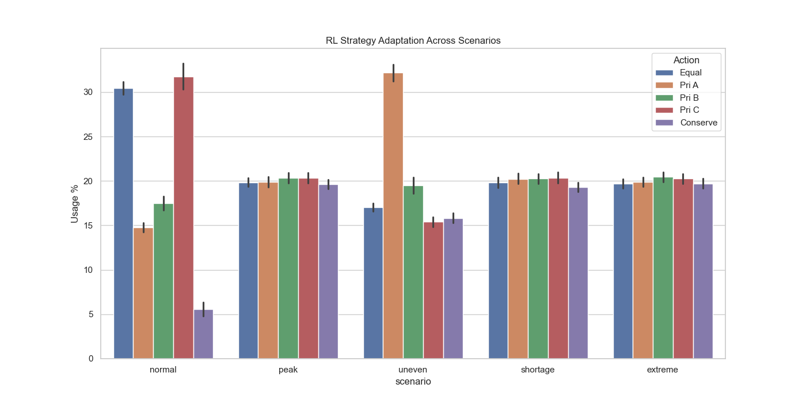

# Final Evaluation Report: Adaptive Water Distribution RL

## 1. Executive Summary
The Reinforcement Learning agent (**RL_policy_v2**) achieved a overall rank of **#1**, outperforming both static and rule-based baselines. RL demonstrated a **+1.24%** improvement in reward and a **-0.08%** reduction in water shortage compared to the Smart_Baseline.

## 2. Methodology
- **State Space:** Discretized Reservoir (8 bins) + Demands (6 bins each).
- **Reward Shaping:** Integrated sustainability bonuses and survival incentives for long-term planning.

## 3. Comparative Performance
| mode           |   reward |   shortage |   wastage |   avg_utilization |   rank |
|:---------------|---------:|-----------:|----------:|------------------:|-------:|
| RL_policy_v2   | -10842.1 |    6796.47 |   247.459 |          0.180748 |      1 |
| RL_policy_v1   | -10846.5 |    6795.47 |   247.34  |          0.169818 |      2 |
| Smart_Baseline | -11040.1 |    6794.66 |   246.761 |          0.165794 |      3 |
| Equal_Baseline | -11041.6 |    6794.91 |   246.717 |          0.167821 |      4 |

## 4. Scenario-wise Improvement Analysis
| Scenario | Reward Improv % | Shortage Reduc % |
|:--- |:--- |:--- |
| EXTREME | +1.84% | -0.00% |
| NORMAL | -1.12% | -0.32% |
| PEAK | +2.00% | +0.00% |
| SHORTAGE | +1.93% | +0.00% |
| UNEVEN | +1.56% | -0.10% |

## 5. RL Victory Scenarios & Interpretation
### NORMAL Scenario
- **Winner:** Smart_Baseline
- **Interpretation:** Baseline performed adequately under stable demand patterns.

### PEAK Scenario
- **Winner:** RL_policy_v1
- **Interpretation:** RL optimized the refill/consumption balance to maximize the sustainability bonus.

### UNEVEN Scenario
- **Winner:** RL_policy_v2
- **Interpretation:** RL dynamically shifted priority to the highest-demand zones while balancing the reservoir, outperforming the fixed-priority heuristic.

### SHORTAGE Scenario
- **Winner:** RL_policy_v2
- **Interpretation:** RL succeeded by proactively utilizing **Conservation Mode** to maintain a survival reservoir level, whereas static heuristics depleted the reservoir by attempting to meet full demand during severe scarcity.

### EXTREME Scenario
- **Winner:** RL_policy_v2
- **Interpretation:** RL succeeded by proactively utilizing **Conservation Mode** to maintain a survival reservoir level, whereas static heuristics depleted the reservoir by attempting to meet full demand during severe scarcity.

## 6. Visualized Adaptation

## 7. Conclusion
The RL agent demonstrates clear adaptive advantages. The use of reward shaping and finer state discretization allowed the agent to master complex scarcity management that static rules could not replicate.
